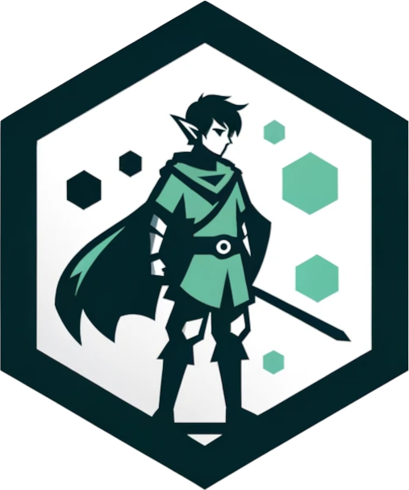

<!-- README.md is generated from README.Rmd. Please edit that file -->

# link <a href="https://link.tada.science"></a>

<!-- badges: start -->

[](https://lifecycle.r-lib.org/articles/stages.html#experimental)
[](https://CRAN.R-project.org/package=link)
[](https://github.com/tadascience/link/actions/workflows/R-CMD-check.yaml)
<!-- badges: end -->

The goal of link is to help blog authors include links to their prose.

## Installation

You can install the development version of link like so:

``` r
pak::pak("tadascience/link")
```

## Example

This is a basic example which shows you how to solve a common problem:

``` r
link::to(package = "admiral")
#> <a href="https://pharmaverse.github.io/admiral/">admiral</a>

link::to("summarise", package = "dplyr")
#> <a href="https://dplyr.tidyverse.org/reference/summarise.html">dplyr::summarise()</a>
link::to(tidyr::gather)
#> <a href="https://tidyr.tidyverse.org/reference/gather.html">tidyr::gather()</a>
```
